Ghana R Users (February 2021)
========================================================
author: Kevin O'Brien
date: 18-February-2021
width: 960
height: 800
transition: linear
css: rpres.css

R Packages
================================


```r
library(tidyverse)

# Graphics & Data Inspection
library(inspectdf)
library(WVPlots)


# Statistics & Modelling
library(MASS)   # installed with Base R
library(car)
```


Simple Linear Regression
==============================================

* In simple linear regression, we predict values on one variable from the values of a second variable. 


* The variable we are predicting is called the ***dependent variable*** (or response variable) and is referred to as Y. 

* The variable we are basing our predictions on is called the ***independent variable*** (or predictor variable) and is referred to as X.

* Remark: When there is only one predictor variable, the prediction method is called simple regression. Linear regression can have more than one predictor variable, i.e. Multiple Linear Regression.

Simple Linear Regression
==============================================

* Suppose we construct our model using $n$ observed values of the response variable: $\{y_1, y_2, \ldots y_i \ldots y_n$\}.

* For the original data set, there is a predicted value of each case of $Y$ that corresponds to an observed value of $Y$. 

* The difference between an observed value of the dependent variable ($y_i$) and the corresponding predicted value ($\hat{y}$) is called the residual ($e_i$). Each data point from the data set has one residual.

Residuals
==============================================

Simply put, the values of the residuals are derived as follows: 

\[\mbox{Residual = Observed value - Predicted value}\]

\[e_i = y_i - \hat{y_i} \]

* Important theoretical assumption underlying the OLS model: the sum of the residuals should equal to zero. 

\[\sum e_i = 0\]

* An extension of this is that the expected value of the residuals is 0: $\mathrm{E}(e) = 0$.
* Another Important Theoretical Assumption - The residuals are normally distributed. (more on that later)


Residual Plots
===================================
* A residual plot is a graph that shows the residuals on the vertical axis and the independent variable on the horizontal axis. 
* If the points in a residual plot are randomly dispersed around the horizontal axis, a linear regression model is appropriate for the data; otherwise, a non-linear model is more appropriate.

Summary of Important Terms
==============================
Some important terms in model diagnostics, essentially a plan for this talk.

*  ***Residual:*** The difference between the predicted value (based on the regression equation) and the actual, observed value.
*  ***Outlier:***  In linear regression, an outlier is an observation with large residual.  In other words, it is an observation whose dependent-variable value is unusual given its value on the predictor variables.  An outlier may indicate a sample peculiarity or may indicate a data entry error or other problem. 

Summary of Important Terms
==============================
*  ***Leverage:***  An observation with an extreme value on a predictor variable is a point with high leverage.  Leverage is a measure of how far an independent variable deviates from its mean.  High leverage points can have a great amount of effect on the estimate of regression coefficients. 
*  ***Influence:***  An observation is said to be influential if removing the observation substantially changes the estimate of the regression coefficients.  Influence can be thought of as the product of leverage and outlierness.  

Summary of Important Terms
==============================
*  ***Cook's distance (or Cook's D):*** A measure that combines the information of leverage and residual of the observation.  

MultiCollinearity
==============================
* An important aspect in model diagnostics is checking for multicollinearity. We are not going to cover this in this talk - but rather include in a talk about variable selection procedure.


Linear modelling with R (Cheeses)
======================================================

#### Cheddar Cheese Taste

* As cheese ages, various chemical processes take place that determine the taste of the final product. 
* This dataset contains concentrations of various chemicals in 30 samples of mature cheddar cheese, and a subjective measure of taste for each sample. 
*The variables "Acetic" and "H2S" are the natural logarithm of the concentration of acetic asid and hydrogen sulfide respectively. 
* The variable "Lactic" has not been transformed.

#### Reference: 

* Moore, David S., and George P. McCabe (1989). Introduction to the Practice of Statistics.


Linear modelling with R (Cheeses)
======================================================

* Number of cases: 30

#### Variable Names:

* **Case**: Sample number
* **Taste**: Subjective taste test score, obtained by combining the scores of several tasters
* **Acetic**: Natural log of concentration of acetic acid
* **H2S**: Natural log of concentration of hydrogen sulfide
* **Lactic**: Concentration of lactic acid


Linear modelling with R (Cheeses)
======================================================


```r
CheesesData <- read_csv("C:/Users/Kevin/Documents/Ghana_R_Users/Cheeses.csv")

head(CheesesData)
```

```
# A tibble: 6 x 5
   Case Taste Acetic   H2S Lactic
  <dbl> <dbl>  <dbl> <dbl>  <dbl>
1     1  12.3   4.54  3.14   0.86
2     2  20.9   5.16  5.04   1.53
3     3  39     5.37  5.44   1.57
4     4  47.9   5.76  7.50   1.81
5     5   5.6   4.66  3.81   0.99
6     6  25.9   5.70  7.60   1.09
```

Linear modelling with R (Cheeses)
======================================================


```r
Fit_1 <- lm(Taste ~ Acetic + Lactic, data = CheesesData)
Fit_2 <- lm(Taste ~ Acetic + H2S, data = CheesesData)
Fit_3 <- lm(Taste ~ H2S + Lactic, data = CheesesData)

Fit_4 <- lm(Taste ~ Acetic + H2S + Lactic, data = CheesesData)
```

Linear modelling with R (Cheeses)
======================================================
class:smaller-95

#### Aikaike Information Criterion


```r
AIC(Fit_1)
```

```
[1] 237.3884
```

```r
AIC(Fit_2)
```

```
[1] 233.2438
```

```r
AIC(Fit_3)
```

```
[1] 227.7838
```

```r
AIC(Fit_4)
```

```
[1] 229.7775
```


{modelr}
=======================
Compute model quality for a given dataset

Three summaries are immediately interpretible on the scale of the response variable:

* ``rmse()`` is the root-mean-squared-error
* ``mae()`` is the mean absolute error
* ``qae()`` is quantiles of absolute error.

{modelr}
=======================

### Root Mean Square Error


```r
library(modelr)
rmse(Fit_4,CheesesData)
```

```
[1] 9.431174
```


### mean absolute error


```r
mae(Fit_4,CheesesData)
```

```
[1] 7.586727
```


{modelr}
=======================


```r
qae(Fit_4,CheesesData)
```

```
       5%       25%       50%       75%       95% 
 1.051164  4.087882  5.238398 10.848030 16.609669 
```

{modelr}
=======================
Other summaries

* ``mape()`` mean absolute percentage error.
* ``rsae()`` is the relative sum of absolute errors.
* ``mse()`` is the mean-squared-error.
* ``rsquare()`` is the variance of the predictions divided by the variance of the response.

{modelr}
=======================


```r
rsquare(Fit_4,CheesesData)
```

```
[1] 0.6517747
```


Diagnostic Plots for Linear Models with R
===================================================

### Plot Diagnostics for an `lm()` Object

There are six plots (selectable by `which=`) are currently available: 

*  a plot of residuals against fitted values, 
*  a Normal Q-Q plot, 
*  a Scale-Location plot of *sqrt( $\|$ residuals $\|$ })* against fitted values, 

*  a plot of Cook's distances versus row labels, 
*  a plot of residuals against leverages, 
*  a plot of Cook's distances against *leverage/(1-leverage)*.

* By default, the first three and 5 are provided, if you just type something like `plot(fit)`.


Diagnostic Plots
======================================================
class:smaller-95

### Diagnostic Plot 1

* The first one displays the residuals vs. the fitted values we use this to evlauate the mean, variance and correlation of residuals.

* If our assumptions of constant variance and uncorrelated residuals are violated we **may** be able to correct this with a variance-stabilizing transformation.

* see ``ncevTest()``


Diagnostic Plots
======================================================
class:smaller-95

### Diagnostic Plot 1


  plot(Fit_4,
     which=1,
     pch=16,lwd=1.2)
   

Just increment the "``which=``" argument with any integer between 1 and 6


Diagnostic Plots
======================================================
class:smaller-95

Diagnostic Plot 1


Diagnostic Plots
======================================================

#### Diagnostic Plot 2

* The second plot helps us check the normality of the residuals. If the
residuals are indeed normal, they should fall along the dashed line.
* Remember that the normality assumption for our errors allows us to determine
the standard errors of our coefficients and predictions.

Diagnostic Plot 2
======================================================
class:smaller-95


 

Diagnostic Plots
======================================================

#### Diagnostic Plot 3

* The ***Scale-Location*** plot, also called 'Spread-Location' (or 'S-L' plot), takes the square root of the absolute residuals in order to diminish skewness (sqrt($|E|$)) is much less skewed than $| E |$ for Gaussian zero-mean E).
 
 
Diagnostic Plots 3
======================================================
class:smaller-95


Diagnostic Plots
======================================================

#### Diagnostic Plot 4

* This plot details the Cook's Distance for each observation. 
* We will revert to this later.
 
 
Diagnostic Plots 4
======================================================
class:smaller-95


Extracting Cook's Distance
======================================================


```r
cooks.distance(Fit_4)
```

```
           1            2            3            4            5            6 
0.0692954594 0.0006538367 0.0322134155 0.0256812534 0.0008307915 0.0028512031 
           7            8            9           10           11           12 
0.0179979270 0.0730650866 0.0058503793 0.0002133561 0.0042356476 0.1231598979 
          13           14           15           16           17           18 
0.0099034331 0.0076724201 0.1714653442 0.0083806741 0.0067909340 0.0345647920 
          19           20           21           22           23           24 
0.0291892000 0.0858382548 0.0001742073 0.0018567690 0.0230305489 0.0172589455 
          25           26           27           28           29           30 
0.0035559153 0.0095340749 0.0307525936 0.0288491545 0.0370008615 0.1017165104 
```

Diagnostic Plots
======================================================

#### Diagnostic Plot 5

* The ***Residual-Leverage*** plot shows contours of equal Cook's distance, for values of `cook.levels` (by default 0.5 and 1) and omits cases with leverage one with a warning. 
* If the leverages are constant the plot uses factor level combinations instead of the leverages for the x-axis. 
* **(The factor levels are ordered by mean fitted value.)**

Diagnostic Plot 5
======================================================
class:smaller-95


Diagnostic Plots
=====================================================

#### Diagnostic Plots 6

* The final plot will display our residuals vs. their leverage. 
* The dashed red lines are level curves that denote a particular value of Cook's distance.
* We will pay attention to points lying beyond the distance of 1. 
* Notice that when we have data with row labels, the points will be labeled with their names. Otherwise, the row number will be shown.

Diagnostic Plot 6
======================================================
class:smaller-95


{broom} R package
=======================

* ``tidy()`` summarizes information about model components such as coefficients of a regression. 
* ``glance()`` reports information about an entire model, such as goodness of fit measures like AIC and BIC. 
* ``augment()`` adds information about individual observations to a dataset, such as fitted values or influence measures.


``tidy()``
=======================


```r
library(broom)
tidy(Fit_4)  %>%
  kable( format = "markdown")
```


|term        |    estimate| std.error|  statistic|   p.value|
|:-----------|-----------:|---------:|----------:|---------:|
|(Intercept) | -28.8767696| 19.735418| -1.4631952| 0.1553991|
|Acetic      |   0.3277413|  4.459757|  0.0734886| 0.9419798|
|H2S         |   3.9118411|  1.248430|  3.1334077| 0.0042471|
|Lactic      |  19.6705434|  8.629055|  2.2795710| 0.0310795|


``glance()``
=======================


```r
glance(Fit_4) %>%
  kable( format = "markdown")
```


| r.squared| adj.r.squared|    sigma| statistic| p.value| df|    logLik|      AIC|      BIC| deviance| df.residual| nobs|
|---------:|-------------:|--------:|---------:|-------:|--:|---------:|--------:|--------:|--------:|-----------:|----:|
| 0.6517747|     0.6115948| 10.13071|  16.22143| 3.8e-06|  3| -109.8888| 229.7775| 236.7835| 2668.411|          26|   30|


``augment()``
=======================


```r
augment(Fit_4) %>%
  head() %>%
  kable( format = "markdown")
```


| Taste| Acetic|   H2S| Lactic|   .fitted|    .resid| .std.resid|      .hat|    .sigma|   .cooksd|
|-----:|------:|-----:|------:|---------:|---------:|----------:|---------:|---------:|---------:|
|  12.3|  4.543| 3.135|   0.86|  1.792448| 10.507552|  1.1420964| 0.1752578| 10.068844| 0.0692955|
|  20.9|  5.159| 5.043|   1.53| 22.637394| -1.737394| -0.1784047| 0.0759313| 10.325007| 0.0006538|
|  39.0|  5.366| 5.438|   1.57| 25.037235| 13.962765|  1.4215258| 0.0599434|  9.921735| 0.0322134|
|  47.9|  5.759| 7.496|   1.81| 37.937537|  9.962463|  1.0299109| 0.0882941| 10.118396| 0.0256813|
|   5.6|  4.663| 3.807|   0.99|  7.017705| -1.417705| -0.1499291| 0.1287953| 10.326866| 0.0008308|
|  25.9|  5.697| 7.601|   1.09| 24.165169|  1.734831|  0.1951982| 0.2303671| 10.323760| 0.0028512|


Definitions: Leverage and Influence
===========================================================


*  ***Studentized Residuals*** :  Residuals divided by their estimated standard errors (like t-statistics). Observations with values larger than 3 in absolute value are considered outliers.
*  ***Leverage Values (Hat Diag)*** :  Measure of how far an observation is from the others in terms of the levels of the independent variables (not the dependent variable). Observations with values larger than $2(k+1)/n$ are considered to be potentially highly influential, where k is the number of predictors and n is the sample size.

Definitions: DFFITS and DFBETAs
===========================================================

*  ***DFFITS*** :  Measure of how much an observation has effected its fitted value from the regression model. Values larger than $2\sqrt{(k+1)/n}$ in absolute value are considered highly influential. 

*  ***DFBETAS*** :  Measure of how much an observation has effected the estimate of a regression coefficient (there is one DFBETA for each regression coefficient, including the intercept). 
* Values larger than ***2/sqrt(n)*** in absolute value are usually considered highly influential.


Definitions: DFFITS and DFBETAs
===========================================================

* The measure that measures how much impact each observation has on a particular predictor is DFBETAs The DFBETA for a predictor and for a particular observation is the difference between the regression coefficient calculated for all of the data and the regression coefficient calculated with the observation deleted, scaled by the standard error calculated with the observation deleted. 


Definitions: Leverage and Influence
===========================================================

*  ***Cook's D*** :  Measure of aggregate impact of each observation on the group of regression coefficients, as well as the group of fitted values. Values larger than 4/n are considered highly influential.

The studentized residual
=============================================================

* The studentized residual RSTUDENT is estimated by $s(i)^2$ without the ith observation, not by $s^2$. For example,

\[\mbox{RSTUDENT} = \frac{r_i}{s_{(i)} \sqrt{(1 - h_i)}} \]
* Observations with RSTUDENT larger than 2 in absolute value may need some attention.


Regression Diagnostics
===================================

An excellent review of regression diagnostics is provided in ***Overview of Regression Diagnostics***. 

Dr. John Fox's {car} package provides advanced utilities for regression modeling. The prestige data set comes with the car package


{gvlma}
========================

* The {gvlma} package is a comprehensive, automatic testing suite for many of the assumptions of general linear models. 
* It does both statistical tests and diagnostic plots using an extremely simple implementation for powerful results.


{gvlma}
========================

The package is an implementation of a paper by Pena & Slate called ***Global Validation of Linear Model Assumptions*** and allows you to quickly check for:

* ***Linearity*** - the Global Stat tests for the null hypothesis that our model is a linear combination of its predictors.

* ***Homoscedasticity*** - the respective stat tests for the null that the residial variance is relatively constant over the range of values.

* ***Normality*** - skewness and kurtosis tests help you understand if the residuals fits a normal distribution. 

* If the null is rejected you probably need to transform your data in some way (like a log transform). 
This can also be assessed by looking at the normal probability plot it generates.	

{gvlma}
========================


```r
  library("gvlma")

  # model <- lm(y ~ x, data)
  
  
  summary(gvlma(model))
```

```

Call:
lm(formula = Taste ~ Acetic + H2S + Lactic, data = CheesesData)

Residuals:
    Min      1Q  Median      3Q     Max 
-17.390  -6.612  -1.009   4.908  25.449 

Coefficients:
            Estimate Std. Error t value Pr(>|t|)   
(Intercept) -28.8768    19.7354  -1.463  0.15540   
Acetic        0.3277     4.4598   0.073  0.94198   
H2S           3.9118     1.2484   3.133  0.00425 **
Lactic       19.6705     8.6291   2.280  0.03108 * 
---
Signif. codes:  0 '***' 0.001 '**' 0.01 '*' 0.05 '.' 0.1 ' ' 1

Residual standard error: 10.13 on 26 degrees of freedom
Multiple R-squared:  0.6518,	Adjusted R-squared:  0.6116 
F-statistic: 16.22 on 3 and 26 DF,  p-value: 3.81e-06


ASSESSMENT OF THE LINEAR MODEL ASSUMPTIONS
USING THE GLOBAL TEST ON 4 DEGREES-OF-FREEDOM:
Level of Significance =  0.05 

Call:
 gvlma(x = model) 

                     Value p-value                Decision
Global Stat        1.33099  0.8561 Assumptions acceptable.
Skewness           1.12180  0.2895 Assumptions acceptable.
Kurtosis           0.02119  0.8843 Assumptions acceptable.
Link Function      0.02906  0.8646 Assumptions acceptable.
Heteroscedasticity 0.15894  0.6901 Assumptions acceptable.
```


{gvlma}
========================
* The diagnostic plots also let you understand the relation between your data and these assumptions visually. 
* Other useful capabilities are the link function test which is used for understanding whether the underlying data is categorical or continuous.


{gvlma}
========================
class:smaller-95


```r
  plot(gvlma(model))
```


Diagnostics panel
=============================================
 
Panel of plots for regression diagnostics.

####Usage 

<pre><code>

ols_plot_diagnostics(model)

</code></pre>

#### Arguments 
 
* ``model``: An object of class lm.


Diagnostics panel
=============================================


```r
model <- Fit_4
ols_plot_diagnostics(model)
```

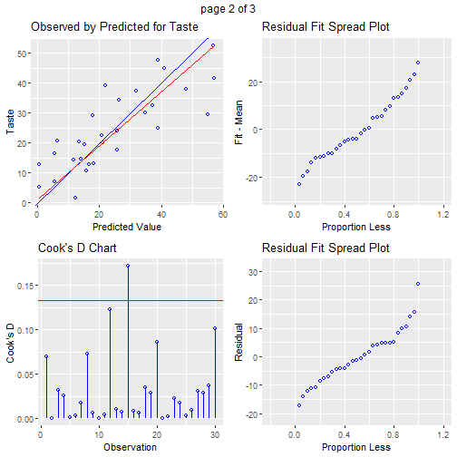


``Residual QQ plot``
=============================================
#### Description 
 
Graph for detecting violation of normality assumption.

####Usage 
<pre><code>
ols_plot_resid_qq(model)
</code></pre>


Residual QQ plot
=============================================


```r
ols_plot_resid_qq(model)
```


``ols_plot_resid_box()``
=================================================
 
Box plot of residuals to examine if residuals are normally distributed.

####Usage 

<pre><code>
ols_plot_resid_box(model)
</code></pre>


``ols_plot_resid_box()``
=================================================


```r
ols_plot_resid_box(model)
```


Breusch pagan test
=================================================

#### Description 
 
Test for constant variance. It assumes that the error terms are normally distributed.

####Usage 
<pre><code>

ols_test_breusch_pagan(model, fitted.values = TRUE, rhs = FALSE,
                       multiple = FALSE, 
                       p.adj = c("none", "bonferroni", "sidak", "holm"),
                       vars = NA)
</code></pre>

Breusch pagan test
=================================================

Breusch Pagan Test was introduced by Trevor Breusch and Adrian Pagan in 1979. It is used to
test for heteroskedasticity in a linear regression model. It test whether variance of errors from a
regression is dependent on the values of a independent variable.

Breusch pagan test
=================================================

* Null Hypothesis: Equal/constant variances
* Alternative Hypothesis: Unequal/non-constant variances
Computation
* Fit a regression model
* Regress the squared residuals from the above model on the independent variables
* Compute nR2. It follows a chi square distribution with p -1 degrees of freedom, where p is
the number of independent variables, n is the sample size and R2 is the coefficient of determination
from the regression in step 2.


#### Value
An object of
class "ols_test_breusch_pagan" is a list containing the following components:

* bp breusch pagan statistic
* p p-value of bp
* fv fitted values of the regression model
* rhs names of explanatory variables of fitted regression model
* multiple logical value indicating if multiple tests should be performed
* padj adjusted p values
* vars variables to be used for heteroskedasticity test
* resp response variable
* preds predictors


Breusch pagan test
=================================================


```r
# model

# use fitted values of the model

ols_test_breusch_pagan(model)
```

```

 Breusch Pagan Test for Heteroskedasticity
 -----------------------------------------
 Ho: the variance is constant            
 Ha: the variance is not constant        

              Data                
 ---------------------------------
 Response : Taste 
 Variables: fitted values of Taste 

        Test Summary         
 ----------------------------
 DF            =    1 
 Chi2          =    1.157465 
 Prob > Chi2   =    0.2819919 
```

```r
# use independent variables of the model
ols_test_breusch_pagan(model, rhs = TRUE)
```

```

 Breusch Pagan Test for Heteroskedasticity
 -----------------------------------------
 Ho: the variance is constant            
 Ha: the variance is not constant        

            Data             
 ----------------------------
 Response : Taste 
 Variables: Acetic H2S Lactic 

        Test Summary         
 ----------------------------
 DF            =    3 
 Chi2          =    4.493994 
 Prob > Chi2   =    0.2128266 
```

Breusch pagan test
=================================================


```r
# use independent variables of the model and perform multiple tests
ols_test_breusch_pagan(model, rhs = TRUE, multiple = TRUE)
```

```

 Breusch Pagan Test for Heteroskedasticity
 -----------------------------------------
 Ho: the variance is constant            
 Ha: the variance is not constant        

            Data             
 ----------------------------
 Response : Taste 
 Variables: Acetic H2S Lactic 

        Test Summary (Unadjusted p values)        
 -----------------------------------------------
  Variable           chi2       df        p      
 -----------------------------------------------
  Acetic           3.8855767     1    0.04870253 
  H2S              0.5192075     1    0.47117994 
  Lactic           1.6874864     1    0.19393265 
 -----------------------------------------------
  simultaneous     4.4939942     3    0.21282661 
 -----------------------------------------------
```

Breusch pagan test
=================================================


```r
# bonferroni p value adjustment
ols_test_breusch_pagan(model, rhs = TRUE, multiple = TRUE, p.adj = 'bonferroni')
```

```

 Breusch Pagan Test for Heteroskedasticity
 -----------------------------------------
 Ho: the variance is constant            
 Ha: the variance is not constant        

            Data             
 ----------------------------
 Response : Taste 
 Variables: Acetic H2S Lactic 

        Test Summary (Bonferroni p values)       
 ----------------------------------------------
  Variable           chi2       df        p     
 ----------------------------------------------
  Acetic           3.8855767     1    0.1461076 
  H2S              0.5192075     1    1.0000000 
  Lactic           1.6874864     1    0.5817979 
 ----------------------------------------------
  simultaneous     4.4939942     3    0.2128266 
 ----------------------------------------------
```

Breusch pagan test
=================================================


```r
# sidak p value adjustment
ols_test_breusch_pagan(model, rhs = TRUE, multiple = TRUE, p.adj = 'sidak')
```

```

 Breusch Pagan Test for Heteroskedasticity
 -----------------------------------------
 Ho: the variance is constant            
 Ha: the variance is not constant        

            Data             
 ----------------------------
 Response : Taste 
 Variables: Acetic H2S Lactic 

          Test Summary (Sidak p values)          
 ----------------------------------------------
  Variable           chi2       df        p     
 ----------------------------------------------
  Acetic           3.8855767     1    0.1391073 
  H2S              0.5192075     1    0.8521151 
  Lactic           1.6874864     1    0.4762621 
 ----------------------------------------------
  simultaneous     4.4939942     3    0.2128266 
 ----------------------------------------------
```

```r
# holm's p value adjustment
ols_test_breusch_pagan(model, rhs = TRUE, multiple = TRUE, p.adj = 'holm')
```

```

 Breusch Pagan Test for Heteroskedasticity
 -----------------------------------------
 Ho: the variance is constant            
 Ha: the variance is not constant        

            Data             
 ----------------------------
 Response : Taste 
 Variables: Acetic H2S Lactic 

          Test Summary (Holm's p values)         
 ----------------------------------------------
  Variable           chi2       df        p     
 ----------------------------------------------
  Acetic           3.8855767     1    0.1461076 
  H2S              0.5192075     1    0.4711799 
  Lactic           1.6874864     1    0.3878653 
 ----------------------------------------------
  simultaneous     4.4939942     3    0.2128266 
 ----------------------------------------------
```

ols_aic Akaike in Format ion criterion
=================================================
#### Description 

Akaike information criterion for model selection.

####Usage 
<pre><code>
  
  ols_aic(model, method = c("R", "STATA", "SAS"))

</code></pre>

``ols_aic Akaike`` in Format ion criterion
=================================================
#### Arguments 
  
* model An object of class lm.
* method A character vector; specify the method to compute AIC. Valid options include R, STATA and SAS.

#### Details 

* AIC provides a means for model selection. Given a collection of models for the data, AIC estimates the quality of each model, relative to each of the other models. 
* R and STATA use loglikelihood to compute AIC. SAS uses residual sum of squares.


``ols_sbc`` Bayesian information criterion
=================================================
#### Description 
 
Bayesian information criterion for model selection.

####Usage 
<pre><code>
ols_sbc(model, method = c("R", "STATA", "SAS"))
</code></pre>

#### Arguments
* ``model``: An object of class lm.
* ``method``: A character vector; specify the method to compute BIC. Valid options include
R, STATA and SAS.

ols_sbc Bayesian information criterion
=================================================


```r
# using R computation method
model <- lm(mpg ~ disp + hp + wt + qsec, data = mtcars)
ols_sbc(model)
```

```
[1] 167.864
```

```r
# using STATA computation method
model <- lm(mpg ~ disp + hp + wt + qsec, data = mtcars)
ols_sbc(model, method = 'STATA')
```

```
[1] 164.3983
```

```r
# using SAS computation method
model <- lm(mpg ~ disp + hp + wt + qsec, data = mtcars)
ols_sbc(model, method = 'SAS')
```

```
[1] 73.58622
```


Cook's Distance
================================================= 

* Cook's distance was introduced by American statistician R Dennis Cook in 1977. 
* It is used to
identify influential data points. 
* It depends on both the residual and leverage .


Cook's Distance
=================================================

Steps to compute Cook's distance:

*  Delete observations one at a time.
*  Refit the regression model on remaining n ???? 1 observations
*  examine how much all of the fitted values change when the ith observation is deleted.


A data point having a large cook's d indicates that the data point strongly influences the fitted values.


Cooks' D bar plot
=================================================
#### Description 
 
Bar Plot of cook's distance to detect observations that strongly influence fitted values of the model.

####Usage 
<pre><code>

ols_plot_cooksd_bar(model)

</code></pre>


Cook's distance:
=================================================

``ols_plot_cooksd_bar`` returns a list containing the following components:

*  outliers a tibble with observation number and cooks distance that exceed threshold
* threshold threshold for classifying an observation as an outlier

Cook's distance:
=================================================


####Examples 

```r
ols_plot_cooksd_bar(model)
```

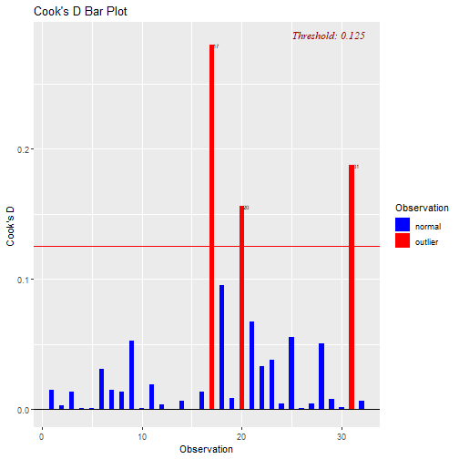
Cook's distance:
=================================================


####Examples 

```r
ols_plot_cooksd_chart(model)
```

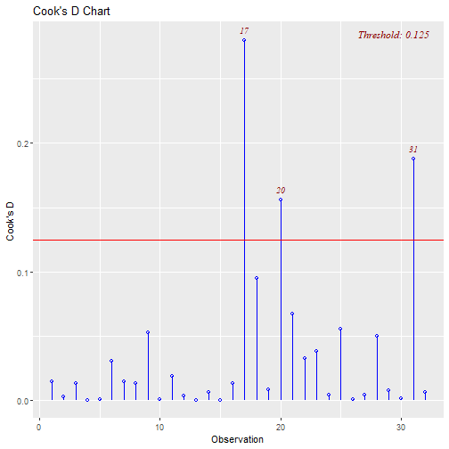

DFBETa:
=================================================


#### Description 
 
Panel of plots to detect influential observations using DFBETAs.

####Usage 
<pre><code>

ols_plot_dfbetas(model)

</code></pre>

#### Arguments 
 
* ``model``: An object of class lm.

#### Details 
 
* DFBETA measures the difference in each parameter estimate with and without the influential point.
* There is a DFBETA for each data point i.e if there are n observations and k variables, there will be
$n - k$ DFBETAs. 
* In general, large values of DFBETAS indicate observations that are influential in estimating a given parameter. 
* Belsley, Kuh, and Welsch recommend 2 as a general cutoff value toindicate influential observations and 2= p
(n) as a size-adjusted cutoff.


####Examples 

```r
ols_plot_dfbetas(model)
```

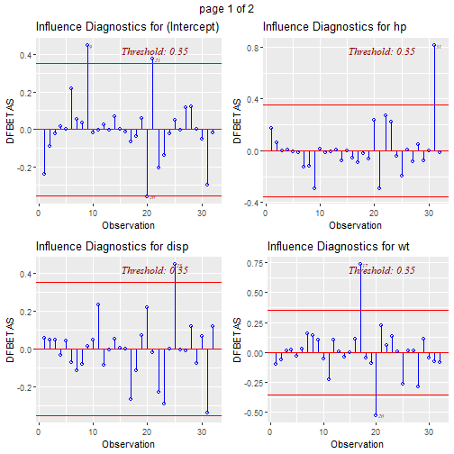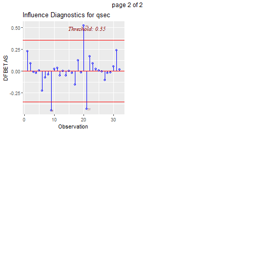


olsrr: Leverage
===========================================
 
The leverage of an observation is based on how much the observation's value on the predictor variable differs from the mean of the predictor variable. The greater an observation's leverage, the more potential it has to be an influential observation.

####Usage 
<pre><code>

ols_leverage(model)

</code></pre>

#### Arguments 
 
* ``model``: An object of class lm.

####Examples 


```r
ols_leverage(model)
```

```
 [1] 0.14830256 0.12992351 0.06317600 0.11598460 0.17187869 0.09986745
 [7] 0.14720085 0.12912656 0.45839085 0.13597113 0.11541159 0.10343044
[13] 0.04684167 0.05527722 0.20578392 0.21066328 0.19546860 0.08593044
[19] 0.14685385 0.14389010 0.11957800 0.11051613 0.08002229 0.10635592
[25] 0.19566514 0.09324142 0.15093650 0.16467565 0.23978580 0.21863752
[31] 0.53168134 0.07953098
```


 Studentized residuals vs leverage plot
=============================================================
#### Description 
 
Graph for detecting outliers and/or observations with high leverage.

####Usage 
<pre><code>

ols_plot_resid_lev(model)

</code></pre>


Studentized residuals vs leverage plot
=============================================================

####Examples 

```r
ols_plot_resid_lev(model)
```

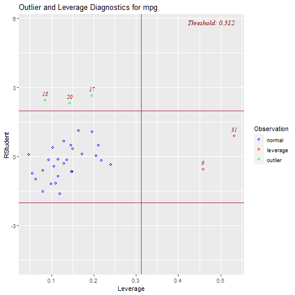


olsrr: PRESS
===========================================
#### Description 
 
PRESS (prediction sum of squares) tells you how well the model will predict new data.


* The prediction sum of squares (PRESS) is the sum of squares of the prediction error.
* Each fitted
to obtain the predicted value for the ith observation. 
* Use PRESS to assess your model's predictive
ability. 
* Usually, the smaller the PRESS value, the better the model's predictive ability.


#### Usage 
<pre><code>

ols_press(model)
</code></pre>


Collinearity diagnostics
===============================================================
#### Collinearity

Variance inflation factor, tolerance, eigenvalues and condition indices.


#### Details 

* Collinearity implies two variables are near perfect linear combinations of one another. 
* Multicollinearity
involves more than two variables.
* In the presence of multicollinearity, regression estimates
are unstable and have high standard errors.

Collinearity diagnostics
===============================================================
 


* ``ols_coll_diag(model)``
* ``ols_vif_tol(model)``
* ``ols_eigen_cindex(model)``


 Collinearity diagnostics
===============================================================


```r
# vif and tolerance
ols_vif_tol(model)
```

```
  Variables Tolerance      VIF
1      disp 0.1252279 7.985439
2        hp 0.1935450 5.166758
3        wt 0.1445726 6.916942
4      qsec 0.3191708 3.133119
```

Collinearity diagnostics
==============================================================


```r
# eigenvalues and condition indices

ols_eigen_cindex(model)
```

```
   Eigenvalue Condition Index   intercept        disp          hp           wt
1 4.721487187        1.000000 0.000123237 0.001132468 0.001413094 0.0005253393
2 0.216562203        4.669260 0.002617424 0.036811051 0.027751289 0.0002096014
3 0.050416837        9.677242 0.001656551 0.120881424 0.392366164 0.0377028008
4 0.010104757       21.616057 0.025805998 0.777260487 0.059594623 0.7017528428
5 0.001429017       57.480524 0.969796790 0.063914571 0.518874831 0.2598094157
          qsec
1 0.0001277169
2 0.0046789491
3 0.0001952599
4 0.0024577686
5 0.9925403056
```

Collinearity diagnostics
===============================================================


```r
# collinearity diagnostics
ols_coll_diag(model)
```

```
Tolerance and Variance Inflation Factor
---------------------------------------
  Variables Tolerance      VIF
1      disp 0.1252279 7.985439
2        hp 0.1935450 5.166758
3        wt 0.1445726 6.916942
4      qsec 0.3191708 3.133119


Eigenvalue and Condition Index
------------------------------
   Eigenvalue Condition Index   intercept        disp          hp           wt
1 4.721487187        1.000000 0.000123237 0.001132468 0.001413094 0.0005253393
2 0.216562203        4.669260 0.002617424 0.036811051 0.027751289 0.0002096014
3 0.050416837        9.677242 0.001656551 0.120881424 0.392366164 0.0377028008
4 0.010104757       21.616057 0.025805998 0.777260487 0.059594623 0.7017528428
5 0.001429017       57.480524 0.969796790 0.063914571 0.518874831 0.2598094157
          qsec
1 0.0001277169
2 0.0046789491
3 0.0001952599
4 0.0024577686
5 0.9925403056
```


Assumption of Constant Variance
============================================

#### Homoscedasticity

* ***Homoscedascity*** is the technical term to describe the variance of the residuals being constant across the range of predicted values. 

* ***Heteroscedascity*** is the converse scenario : the variance differs along the range of values.


Suppose you plot the individual residuals against the predicted value, the variance of the residuals predicted value should be constant (Diagnostic Plot 1). 


Using R
=====================================

```r
# Evaluate homoscedasticity

# non-constant error variance test

library(car)
ncvTest(fit)
```

```
Non-constant Variance Score Test 
Variance formula: ~ fitted.values 
Chisquare = 1.157465, Df = 1, p = 0.28199
```


Nonlinearity
=============================================================

#### component + residual plot 


```r
# Evaluate Nonlinearity

# component + residual plot 


crPlots(fit)
```

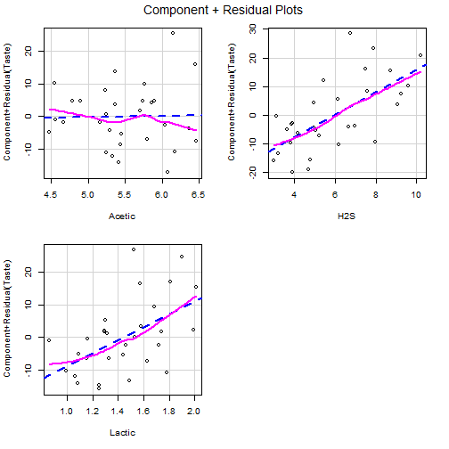


Nonlinearity
=============================================================

#### ceres plot


```r
# Ceres plots 

ceresPlots(fit)
```


Nonlinearity
=============================================================


Non-independence of Errors


```r
# Test for Autocorrelated Errors

durbinWatsonTest(fit)
```

```
 lag Autocorrelation D-W Statistic p-value
   1       0.1692325       1.57513    0.16
 Alternative hypothesis: rho != 0
```


Outliers
===========================================

* *"Outliers are sample values that cause surprise in relation to the majority of the sample"* 

* (W.N. Venables and B.D. Ripley. 2002. Modern applied statistics with S. New York: Springer, p.119).


* Crucially, surprise is in the mind of the beholder and is dependent on some explicit model of the data. 

* Importantly, Normality is only an assumption:There may be another model under which the outlier is not surprising at all, say if the data really are lognormal or 
gamma rather than normal. 

Outliers
===========================================

* Data points that diverge in a big way from the overall pattern are referred to as ``outliers".\\ 

* In the case of Simple Linear Regression, there are four ways that a data point might be considered an outlier.


  *  It could have an extreme X value compared to other data points.
  *  It could have an extreme Y value compared to other data points.
  *  It could have extreme X and Y values.
  *  It might be distant from the rest of the data, even without extreme X or Y values.


Outliers
===========================================

*  After a regression line has been computed for a group of data, a point which lies far from the line 
(and thus has a large residual value) is known as an outlier. 
Such points may represent erroneous data, or may indicate a poorly fitting regression line. 

*  If a point lies far from the other data in the horizontal direction, it is known as an ***influential observation***. 
* The reason for this distinction is that these points have may have a significant impact on the slope of the regression line.

Outliers
===========================================


#### ``outlierTest()``
* Suppose we have some fitted models and we would like to see if there are any outliers. 

* For this purpose, we can use ``outlierTest()`` from {car} R package. 


Outliers
===========================================


```r
library(car)
outlierTest(Fit_1)   
```

```
No Studentized residuals with Bonferroni p < 0.05
Largest |rstudent|:
   rstudent unadjusted p-value Bonferroni p
15   2.3563           0.026274      0.78821
```


```r
outlierTest(Fit_2)   
```

```
No Studentized residuals with Bonferroni p < 0.05
Largest |rstudent|:
   rstudent unadjusted p-value Bonferroni p
15  2.48439           0.019742      0.59225
```

Outliers
===========================================


```r
outlierTest(Fit_3)   
```

```
No Studentized residuals with Bonferroni p < 0.05
Largest |rstudent|:
   rstudent unadjusted p-value Bonferroni p
15  2.98867          0.0060495      0.18148
```


```r
outlierTest(Fit_4)   
```

```
No Studentized residuals with Bonferroni p < 0.05
Largest |rstudent|:
   rstudent unadjusted p-value Bonferroni p
15  3.01547          0.0058177      0.17453
```


Regression Diagnostics:avPlots
==========================

#### `avPlots`

*  Graphs outcome vs predictor variables holding the rest constant (also called partial-regression plots)
*  Help identify the effect(or influence) of an observation on the regression coefficient of the predictor variable

Regression Diagnostics: avPlots
===================================


```r
library(car)
reg1 <-lm(prestige ~ education + income + type, data = Prestige)
avPlots(reg1)
```

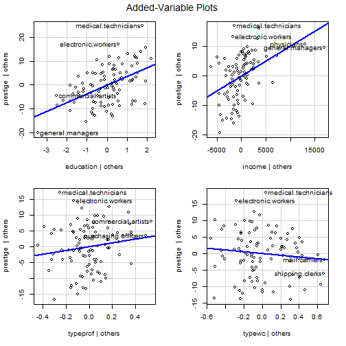
Regression Diagnostics: `influenceIndexPlot()`
===================================

#### `influenceIndexPlot`

*  Cook's distance measures how much an observation influences the overall model or predicted values
*  Studentizided residuals are the residuals divided by their estimated standard deviation as a way to standardized
*  Bonferronitest to identify outliers
*  Hat-points identify influential observations (have a high impact on the predictor variables)


Regression Diagnostics :`influenceIndexPlot()`
===================================


```r
library(car)
reg1 <-lm(prestige ~ education + income + type, data = Prestige)
influenceIndexPlot(reg1)
```


#### `influencePlot`

*  `influencePlot()` creates a bubble-plot combining the display of Studentizedresiduals, hat-values, and Cook's distance (represented in the circles).


```r
library(car)
reg1 <-lm(prestige ~ education + income + type, data = Prestige)
influencePlot(reg1)
```

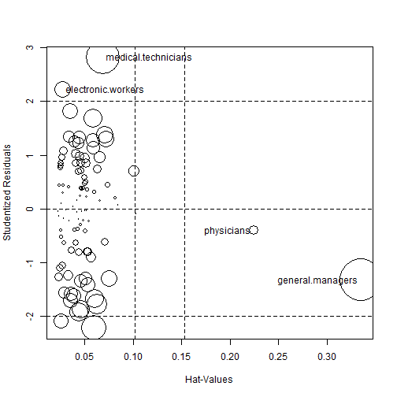

```
                       StudRes        Hat       CookD
general.managers    -1.3134574 0.33504477 0.172503975
physicians          -0.3953204 0.22420309 0.009115491
medical.technicians  2.8210910 0.06858836 0.109052582
electronic.workers   2.2251940 0.02701237 0.026372394
```


Alcohol and Tobacco Data
========================================
This example is for exposition only. We will ignore the fact that this may not be a great way of modeling the this particular set of data!


```r
alctob <- data.frame( cbind(
Alcohol = c(6.47, 6.13, 6.19, 4.89, 5.63, 4.52, 
            5.89, 4.79, 5.27, 6.08, 4.02),
Tobacco = c(4.03, 3.76, 3.77, 3.34, 3.47, 2.92, 
            3.20, 2.71, 3.53, 4.51, 4.56)),
row.names = c("North", "Yorkshire", "Northeast", 
"East Midlands", "West Midlands", "East Anglia", 
"Southeast", "Southwest", "Wales", 
"Scotland", "N. Ireland"))
```


```r
alctobwo <- subset(alctob,rownames(alctob)!="N. Ireland") 
#without North Ireland

plot(alctob$Tobacco, alctob$Alcohol,
main="Weekly Household Spending on Alcohol vs. Tobacco",
xlab="Tobacco Spending (GBP)",
ylab="Alcohol Spending (GBP)",
pch=16,col="red",cex=1.5,font.lab=2) 
```


```r
#note N. Ireland in the bottom-right
```


```r
fit1 <- lm( Alcohol ~ Tobacco, data = alctob)
fit2 <- lm( Alcohol ~ Tobacco, data = alctobwo)
```
All Observations
=================================================


```r
summary(fit1)
```

```

Call:
lm(formula = Alcohol ~ Tobacco, data = alctob)

Residuals:
    Min      1Q  Median      3Q     Max 
-1.7080 -0.4245  0.2311  0.6081  0.9020 

Coefficients:
            Estimate Std. Error t value Pr(>|t|)  
(Intercept)   4.3512     1.6067   2.708   0.0241 *
Tobacco       0.3019     0.4388   0.688   0.5087  
---
Signif. codes:  0 '***' 0.001 '**' 0.01 '*' 0.05 '.' 0.1 ' ' 1

Residual standard error: 0.8196 on 9 degrees of freedom
Multiple R-squared:  0.04998,	Adjusted R-squared:  -0.05557 
F-statistic: 0.4735 on 1 and 9 DF,  p-value: 0.5087
```


Outlier Removed
============================================

```r
summary(fit2)
```

```

Call:
lm(formula = Alcohol ~ Tobacco, data = alctobwo)

Residuals:
     Min       1Q   Median       3Q      Max 
-0.51092 -0.42434  0.06056  0.34406  0.62991 

Coefficients:
            Estimate Std. Error t value Pr(>|t|)   
(Intercept)   2.0412     1.0014   2.038  0.07586 . 
Tobacco       1.0059     0.2813   3.576  0.00723 **
---
Signif. codes:  0 '***' 0.001 '**' 0.01 '*' 0.05 '.' 0.1 ' ' 1

Residual standard error: 0.446 on 8 degrees of freedom
Multiple R-squared:  0.6151,	Adjusted R-squared:  0.567 
F-statistic: 12.78 on 1 and 8 DF,  p-value: 0.007234
```


Outliers
==============


The conservative outlier test that we talked about in class uses the
Bonferonni inequality to calculate the p-values we associate with the
Student's-t test. 

In R, we can use the `outlierTest()`` command to perform this
test on our model. Remember that when we test for influence, we are testing
the effect of an observation on model coefficients. 

Therefore we need to
give the outlierTest command a linear model as its input.


```r
outlierTest(fit1)
```

```
            rstudent unadjusted p-value Bonferroni p
N. Ireland -4.732091          0.0014789     0.016268
```

We can also use R to calculate Cook's distance. 
Here we label any observation with Cook's distance greater than 1 as influential.


```r
cooks.distance(fit1)
```

```
        North     Yorkshire     Northeast East Midlands West Midlands 
  0.114101051   0.036517838   0.043728951   0.023600304   0.004740759 
  East Anglia     Southeast     Southwest         Wales      Scotland 
  0.147326647   0.046646563   0.077488350   0.001821694   0.068921892 
   N. Ireland 
  1.747233521 
```


Finally, one of the easier ways to evaluate our residuals and look for
for influential points is through plots. 


```r
#qq plot for studentized resid 
qqPlot(fit1, main="QQ Plot",pch=18, lim=c(-3,2)) 
```

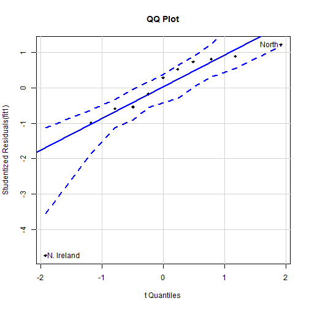

```
     North N. Ireland 
         1         11 
```

```r
# leverage plots
leveragePlots(fit1) 
```

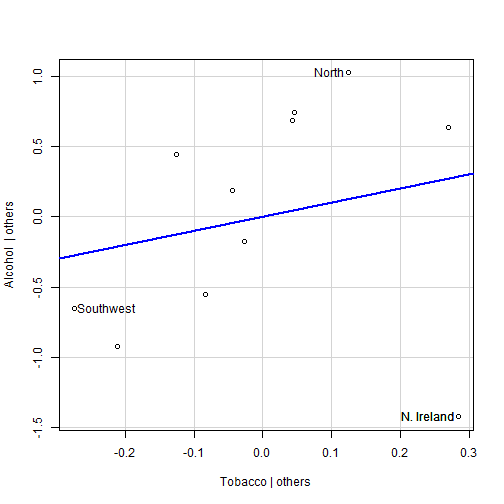


```r
# Influential Observations
# Influential Observations
# added variable plots 
avPlots(fit1)
```


```r
# Cook's D plot
# identify D values > 4/(n-k-1) 
cutoff <- 4/((nrow(mtcars)-length(fit1$coefficients)-2)) 
plot(fit, which=4, cook.levels=cutoff)
```


```r
# Influence Plot 
influencePlot(fit1,id.method="identify", 
main="Influence Plot", 
col="red",
sub="Circle size is proportial to Cook's Distance" )
```

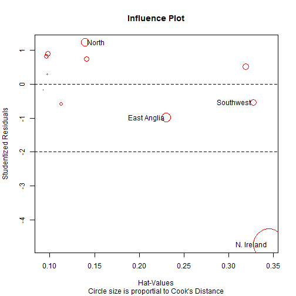

```
               StudRes       Hat      CookD
North        1.2178081 0.1395123 0.11410105
East Anglia -0.9904538 0.2306073 0.14732665
Southwest   -0.5417970 0.3272829 0.07748835
N. Ireland  -4.7320908 0.3451163 1.74723352
```

Non-normality
=============


```r
# Normality of Residuals
# qq plot for studentized resid
qqPlot(fit1, main="QQ Plot")
```

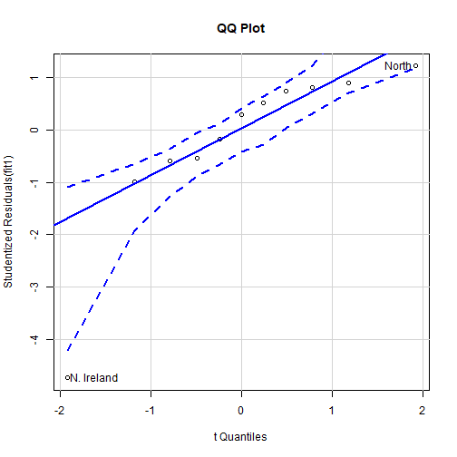

```
     North N. Ireland 
         1         11 
```


```r
# distribution of studentized residuals
library(MASS)
sresid <- studres(fit) 
hist(sresid, freq=FALSE, 
main="Distribution of Studentized Residuals")
xfit<-seq(min(sresid),max(sresid),length=40) 
yfit<-dnorm(xfit) 
lines(xfit, yfit)
```


Non-constant Error Variance
==================================


```r
# Evaluate homoscedasticity
# non-constant error variance test
ncvTest(fit)
```

```
Non-constant Variance Score Test 
Variance formula: ~ fitted.values 
Chisquare = 3.311276, Df = 1, p = 0.068806
```

```r
# plot studentized residuals vs. fitted values 
spreadLevelPlot(fit)
```

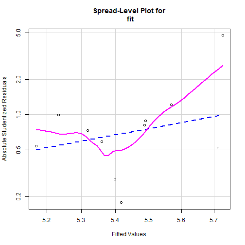

```

Suggested power transformation:  -5.624329 
```


