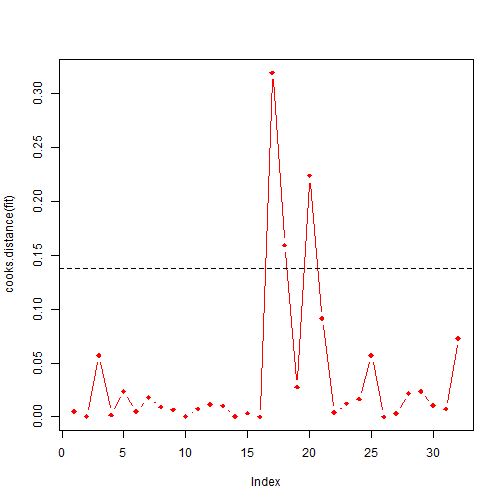
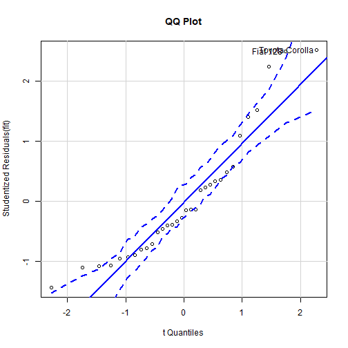

RESIDUALS
========================================================
author: 
date: 
autosize: true


Cook's Distance
==================================
*  Cook's distance or Cook's D is a commonly used estimate of the influence of a data point when performing least squares regression analysis.

*  Cook's distance is useful for identifying outliers in the X values (observations for predictor variables). It also shows the influence of each observation on the fitted response values. 
*  \textbf{(Case Deletion Diagnostics)} If  predictions are the same with or without the observation in question, then the observation has no influence on the regression model. If the predictions differ greatly when the observation is not included in the analysis, then the observation is influential.
 *  Cook's distance measures the effect of deleting a given observation. Data points with large residuals (outliers) and/or high leverage may distort the outcome and accuracy of a regression. 

Cook's Distance
==================================

*  
Cook's distance is the scaled change in fitted values. Each resulting element in a diagnostic calculation is the normalized change in the vector of coefficients due to the deletion of an observation. 

*  In a practical ordinary least squares analysis, Cook's distance can be used in several ways: to indicate data points that are particularly worth checking for validity; to indicate regions of the design space where it would be good to be able to obtain more data points. 
*  
It is named after the American statistician R. Dennis Cook, who introduced the concept in 1977.


Cook's Distance
==================================
*  Points with a large Cook's distance are considered to merit closer examination in the analysis. 

*  Influential cases are not usually a problem when their removal from the dataset would leave the parameter estimates essentially unchanged: the ones we worry about are those whose presence really does change the results. 

Cook's Distance Formula
==================================

Cook's D is a good measure of the influence of an observation and is proportional to the sum of the squared differences 
between predictions made with all observations in the analysis and predictions made leaving out the observation in question.

It is calculated as:
\[D_i = \frac{ \sum_{j=1}^n (\hat Y_j\ - \hat Y_{j(i)})^2 }{p \ \mathrm{MSE}},
\]

where:

*  $\hat Y_j$ \, is the prediction from the full regression model for observation j;
*  $\hat Y_{j(i)}$\, is the prediction for observation j from a refitted regression model in which observation i has been omitted;
*  $p$ is the number of fitted parameters in the model;
*  $\mathrm{MSE} $ \, is the mean square error of the regression model.


For the case of simple linear regression, the following are the algebraically equivalent expressions 
\[D_i = \frac{e_i^2}{p \ \mathrm{MSE}}\left[\frac{h_{ii}}{(1-h_{ii})^2}\right],
\]

\[
D_i = \frac{ (\hat \beta - \hat {\beta}^{(-i)})^T(X^TX)(\hat \beta - \hat {\beta}^{(-i)}) } {(1+p)s^2},
\]

where:

*  $h_{ii} \,$ is the leverage, i.e., the i-th diagonal element of the hat matrix  \[\mathbf{X}\left(\mathbf{X}^T\mathbf{X}\right)^{-1}\mathbf{X}^T\]
*  $e_i$ \, is the residual (i.e., the difference between the observed value and the value fitted by the proposed model).


\texttt{R} code for computing Cook's Distance
=================================================================


```r
attach(mtcars)
fit = lm(mpg ~ cyl + wt )
cooks.distance(fit)
```

```
           1            2            3            4            5            6 
0.0050772590 0.0004442585 0.0567764620 0.0018029260 0.0235271472 0.0050205614 
           7            8            9           10           11           12 
0.0178733213 0.0091033181 0.0065061176 0.0004643600 0.0075293380 0.0116847953 
          13           14           15           16           17           18 
0.0102875723 0.0005228914 0.0035498738 0.0001501537 0.3189363624 0.1592990291 
          19           20           21           22           23           24 
0.0276449872 0.2233281268 0.0913548207 0.0040263378 0.0120218543 0.0165559199 
          25           26           27           28           29           30 
0.0569730451 0.0001790454 0.0033281614 0.0216355209 0.0237336584 0.0105550987 
          31           32 
0.0072685192 0.0727399065 
```

```r
plot(cooks.distance(fit),type="b",pch=18,col="red")

N = 32
k = 2
cutoff = 4/ (N-k-1)
abline(h=cutoff,lty=2)
```




Interpreting Cook's Distance
==============

A common rule of thumb is that an observation with a value of Cook's D over 1.0 has too much influence. As with all rules of thumb, this rule should be applied judiciously and not thoughtlessly. (John Fox)\\ \textit{(1991). Regression Diagnostics: An Introduction. Sage Publications.}

Interpretation
=============================

*  Some texts tell you that points for which Cook's distance is higher than 1 are to be considered as influential. 
*  Other texts give you a threshold of $4/N$ or \[ {4  \over (N-k-1)} ,\] where N is the number of observations and k the number of explanatory variables. 
*  The \texttt{R} help file advises that an observation with Cook's distance larger than three times the mean Cook's distance might be an outlier. .

*  John Fox (mentioned above), in his booklet on regression diagnostics is rather cautious when it comes to giving numerical thresholds. He advises the use of graphics and to examine in closer details the points with "values of D that are substantially larger than the rest". According to Fox, thresholds should just be used to enhance graphical displays.

Cook's Distance in relation to other measures
===================================================

*  Cook's distance refers to how far, on average, predicted y-values will move if the observation in question is dropped from the data set. 
*  \textbf{DFBETA} :  \textit{DFBETA} refers to how much a parameter estimate changes if the observation in question is dropped from the data set.

*   \textit{Note that with k covariates, there will be k+1 DFBETAs (the intercept, $\beta_0$, and $\beta_1$ for each covariate).}
*   Cook's distance is arguably more important if you are doing predictive modeling, whereas \textit{DFBETA} is more important in explanatory modeling.
*  \textbf{DFFITS}: Although the raw values resulting from the equations are different, Cook's distance and \textit{DFFITS} are conceptually identical and there is a closed-form formula to convert one value to the other.


Cook's Distance
===========================================

The hat matrix, H, sometimes also called influence matrix and projection matrix, maps the vector of observed values to the vector of 
fitted values (or predicted values). It describes the influence each observed value has on each fitted value.

The diagonal elements of the hat matrix are the leverages, which describe the influence each observed value has on the fitted value for that same observation.
 
If the vector of observed values is denoted by y and the vector of fitted values by $\hat{y}$,
 
$$ \hat{y} = H y$$

Leverage Score
===========================================

In linear regression model, the leverage score for \[ h_{ii} = (H)_{ii}\] the $i-th$ data unit is defined as:

 
$$ H = X(X^{T} X)^{-1}X^{T} $$
the diagonal of the hat matrix.


The leverage score is also known as the observation self-sensitivity or self-influence

Leverage Score
===========================================

The leverage of an observation is based on how much the observation's value on the predictor variable differs from the 
mean of the predictor variable. The greater an observation's leverage, the more potential it has to be an influential observation. 

For example, an observation with a value equal to the mean on the predictor variable has no influence on the slope of the regression line regardless of its value on the criterion variable. On the other hand, an observation that is extreme on the predictor variable has the potential to affect the slope greatly.


Leverage Score
===========================================

* In statistics, leverage is a term used in connection with regression analysis and, in particular, in analyses aimed at identifying those observations that are far away from corresponding average predictor values.

* Generally, a point with leverage greater than $(2k+2)/n$ should be carefully examined, where k is the number of predictor variables and n is the number of observations.
*  Leverage points do not necessarily have a large effect on the outcome of fitting regression models.

* Leverage points are those observations, if any, made at extreme or outlying values of the independent variables such that the lack of neighboring observations means that the fitted regression model will pass close to that particular observation.

Standardization
===================================
Another result of the fact that points further out on X have more leverage is that they tend to be closer to the regression line (or more accurately: the regression line is fit so as to be closer to them) than points that are near $\bar{x}$. In other words, the residual standard deviation can differ at different points on X (even if the error standard deviation is constant). To correct for this, residuals are often standardized so that they have constant variance (assuming the underlying data generating process is homoscedastic, of course).

Calculation of Leverage (h)
====================================================


The first step is to standardize the predictor variable so that it has a mean of 0 and a standard deviation of 1. 
Then, the leverage (h) is computed by squaring the observation's value on the standardized predictor variable, adding 1, 
and dividing by the number of observations.


```r
library(car)
fit <- lm(mpg~disp+hp+wt+drat, data=mtcars) 

#qq plot for studentized residuals
qqPlot(fit, main="QQ Plot")  
```



```
      Fiat 128 Toyota Corolla 
            18             20 
```

```r
# leverage plots
leveragePlots(fit) 
```


