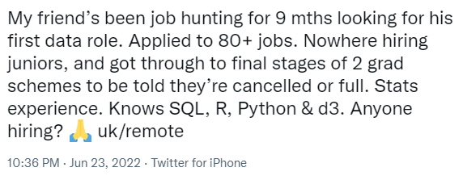
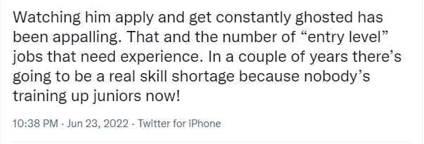
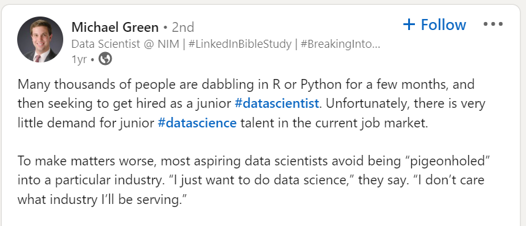
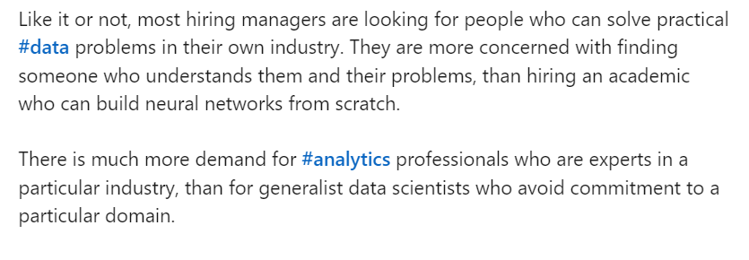
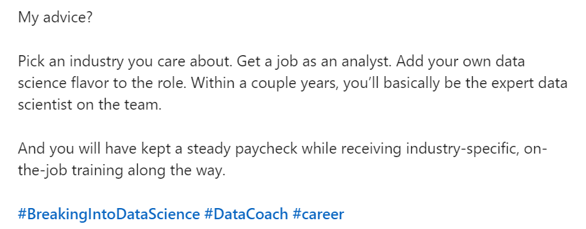

### Data Science Careers

 

---

### <tt>Tweet by @Type_Error</tt>

 

---

### Domain Knowledge 

* Michael Green  (Data Scientist @ NIM)

Comments on LinkedIn

https://www.linkedin.com/feed/update/urn:li:activity:6765853465861267456/

---

### Importance of Domain Knowledge (1)

 

(*screenshot of LinkedIn Post listed previously - Part 1*)

---

### Importance of Domain Knowledge (2)

 
(*screenshot of LinkedIn Post listed previously  - Part 2*)

---

### Importance of Domain Knowledge (3)

 
(*screenshot of LinkedIn Post listed previously - Part 3*)

---

### Stripe

---

### Career Strategy

Think about tedious boring jobs that can be automated, and processes that can be made more efficient

 