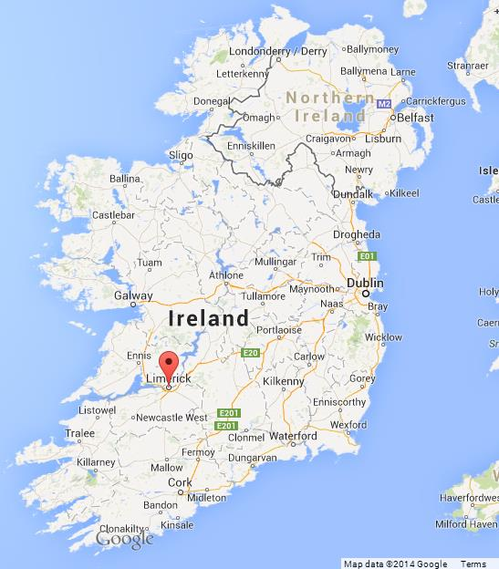
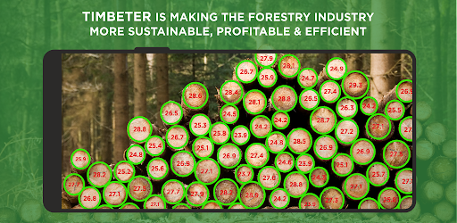

### Kevin O'Brien

- Agricultural Data Scientist based in the West of Ireland 
  - Also in London, UK a lot
  
- Why R? - Community Team lead & Webinars co-ordinator (on hiatus)

- Python Ireland - Director and Conference Lead

- JuliaCon 2022 - Social Media Chair

- Was previously (what is now known) as a "Research Software Engineer" in a University.

---


---

### Agriculture and Forestry


* R is very useful in Forestry 
 - Diameter at Breast Height / Height
 - Growth Curves and Yield Models
 - Statistical Analysis and Data Visualization
 
* Other R packages have been ***VERY*** useful 



---

```{r child="Career.Rmd"}
```

```{r echo=FALSE}
### CAREER
# - FINISHED
```

---

```{r child="Files_And_Directories.Rmd"}


```

```{r echo=FALSE}
### FILES AND DIRECTORIES

# add {here} CRAN website
```
---


```{r child="excel.Rmd"}
```

---


### Working with Documents

* Agriculture and Forestry is highly regulated in Ireland 
  - (Water quality, natural heritage, habitats)
* Lots of documents
* Government agencies strongly prefer Microsoft Word and PDFs
* Legal Documents
* Time consuming


---

```{r child="pdftools.Rmd"}

```

---

```{r child="doconv.Rmd"}
```

```{r echo=FALSE}
### doconv
# - Finished 
```


---

```{r child="stringr.Rmd"}

```
---

### Officerverse

* David Gohel

* https://www.ardata.fr/
* davidgohel.github.io

#### R Packages

* Officer 
* Flextable 
* Officedown


---


```{r child="officer.Rmd"}

```
```{r echo=FALSE}
### OFFICER

```

---


```{r child="flextable.Rmd"}

```


---

### Useful R packages

* <tt> {tidyverse} </tt>
* <tt> {janitor} </tt>
* <tt> {scales} </tt>

### Useful Commands

* <tt> sprintf() </tt>


---


```{r child="JuliaCon.Rmd"}

```


---


