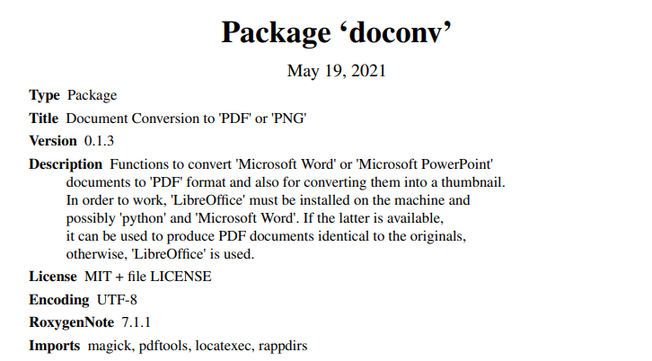

---

#### Package Author

* David Gohel (Ardata.Fr)
* Twitter : <tt>@DavidGohel</tt>

#### doconv: Document Conversion to 'PDF' or 'PNG'

* Functions to convert 'Microsoft Word' or 'Microsoft PowerPoint' documents to 'PDF' format and also for converting them into a thumbnail. 

* In order to work, 'LibreOffice' must be installed on the machine and possibly 'python' and 'Microsoft Word'. 

* If the latter is available, it can be used to produce PDF documents identical to the originals, otherwise, 'LibreOffice' is used.

---

<tt>docx2pdf</tt> Convert docx to pdf

#### Description

* Convert docx to pdf directly using "Microsoft Word". This function will not work if "Microsoft
Word" is not available on your machine.

* On Windows, this is implemented via win32com while on macOS this is implemented via JXA
(Javascript for Automation, aka AppleScript in JS).

#### Usage 

<pre><code>
docx2pdf(input, output = gsub("\\.docx$", ".pdf", input))

</code></pre>
