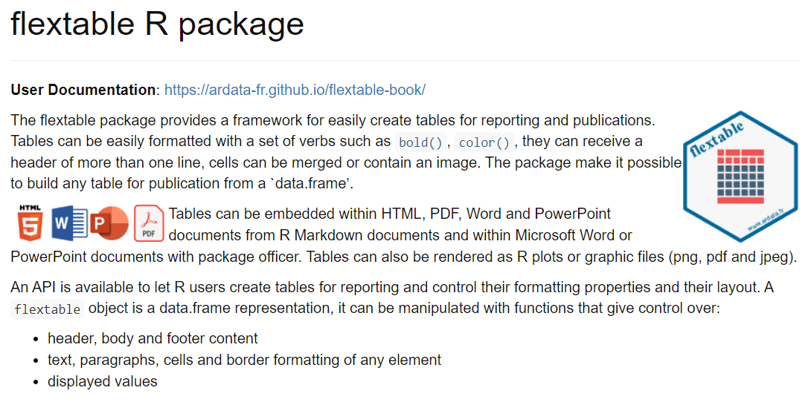
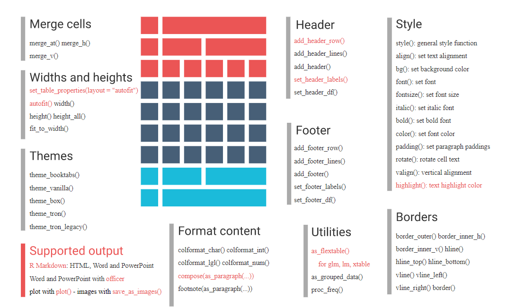
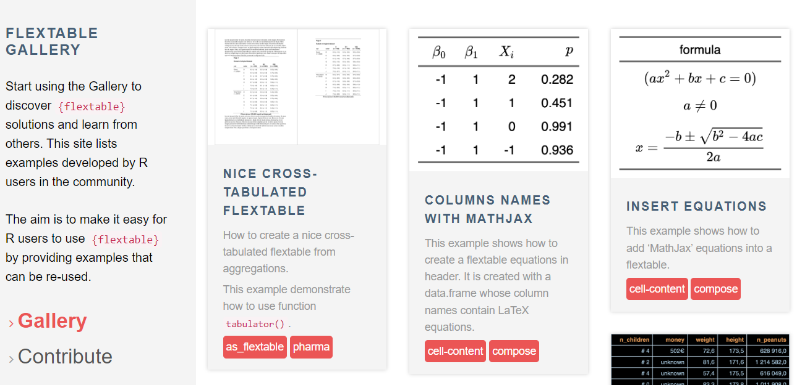

### Flextable R Package

Automated Generation of Tables with R

(***Author: David Gohel***)
---

### Flextable R Package

Automated Generation of Tables with R

(***Author: David Gohel***)

---

### Flextable R Package

<pre><code>
This_OutPut_Table  <- This_Input_DF %>% 
  flextable() %>% 
  width(width=c(2.25,4.75)) %>%  
  align( align = "left", part = "all" ) %>%
  font(fontname = "Calibri",part="all") %>%
  fontsize(size = 12, part = "body") %>%
  padding(padding = 3, part = "all" ) %>%
  delete_part(part="header") %>%
  border_remove() %>%
  border_outer( part="all", border = big_border ) %>%
  border_inner_h(part="all", border = big_border ) %>%
  border_inner_v(part="all", border = big_border ) 

my_doc <- my_doc %>% 
  body_add_flextable(This_OutPut_Table,align="left") %>%
  body_add_par("", style = "Normal")

</code></pre>

---

### Flextable Gallery

<tt> ardata-fr.github.io/flextable-gallery/gallery/ </tt>

(***Author: David Gohel***)
