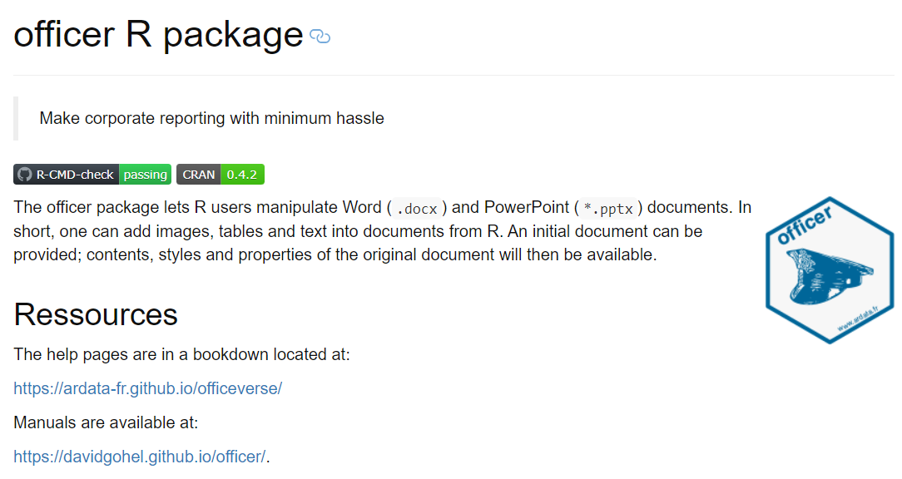

### Officer R Package

Automated Generation of Word Documents with R

---

### Officer R Package

#### Examples

<pre><code>
my_doc <- read_docx() %>%
      body_add_par(value='Some text etc etc') %>%
      body_add_flextable(value=ft) %>% 
      body_add_break()
      
</code></pre>      

* Formatted Text
* Add Images
* Replace Text in existing document

---

### Officer R Package

#### Example

<pre><code>

MyText_header <- fpar(ftext(MyText_header ,  
		prop = fp_text(color = "black", font.family="Calibri", 
		font.size = 14, bold = TRUE)))

MyText_1 <- fpar(ftext(MyText_1 ,  
		prop = fp_text(color = "black", font.family="Calibri", 
		font.size = 12, bold = FALSE)))

MyText_2  <- fpar(ftext(MyText_2 ,  
		prop = fp_text(color = "black", font.family="Calibri", 
		font.size = 12, bold = FALSE)))

</code></pre>

---

### Officer R Package

#### Example

<pre><code>
my_doc <- my_doc  %>% 
  body_add_fpar( MyText_header ) %>%   
  body_add_par("", style = "Normal") %>%
  body_add_fpar( MyText_1 ) %>%   
  body_add_par("", style = "Normal") %>%
  body_add_fpar( MyText_2) %>%   
  body_add_par("", style = "Normal")

print(my_doc, target = Output_File_Name)
</code></pre>