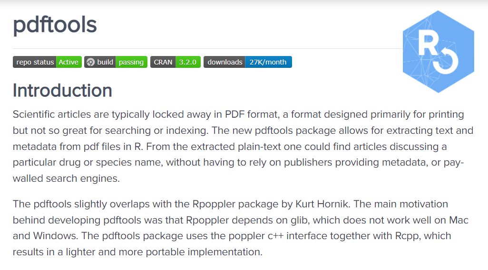
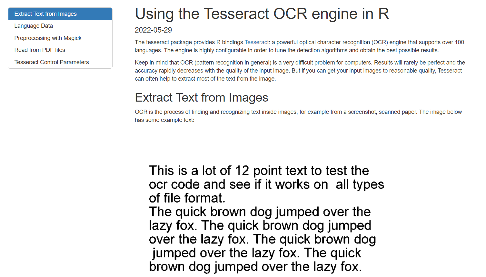
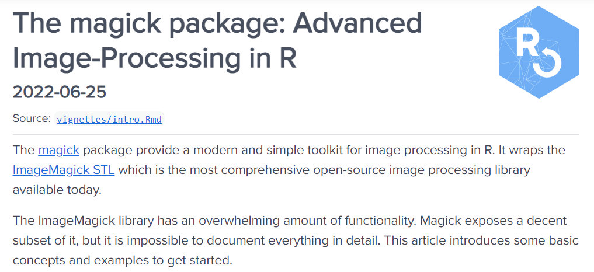

### PDF Tools

(***Source: ROpenSci Organization***)
---

### Usage

<pre> <code>
pdf_info(pdf, opw = "", upw = "")

pdf_text(pdf, opw = "", upw = "")

pdf_data(pdf, font_info = FALSE, opw = "", upw = "")

pdf_fonts(pdf, opw = "", upw = "")

pdf_attachments(pdf, opw = "", upw = "")

pdf_toc(pdf, opw = "", upw = "")

pdf_pagesize(pdf, opw = "", upw = "")

</code></pre>

---

### <tt>pdf_text()</tt>

* Extract text from an inputed PDF document.
* Each line corresponds to a single string

<pre><code>

myPDFText <- pdf_text( myInputPDF )

</code></pre>

#### Processing

* Very high accuracy for PDF documents that were created directly from MS Word. (i.e. Save as "PDF")
* Taking advantage of the standardized format of the documents, the contents can be processed and add to a single spreadsheet.

---

### <tt>pdf_combine()</tt>

<pre><code>

library(pdftools)

# Combine 2 two-page documents

pdf_combine(
  input = c("TESTPAGE1.pdf", "TESTPAGE2.pdf"), 
  output = "TESTCOMBINED.pdf")

# Should say 4
pdf_length("TESTCOMBINED.pdf")
</code></pre>

---

### Tesseract

Useful for more complicated scans (photocopies)

---

### magick R package

#### The magick R package supports:

* Many common formats: png, jpeg, tiff, pdf, etc
* Different manipulations types: rotate, scale, crop, trim, flip, blur, etc.