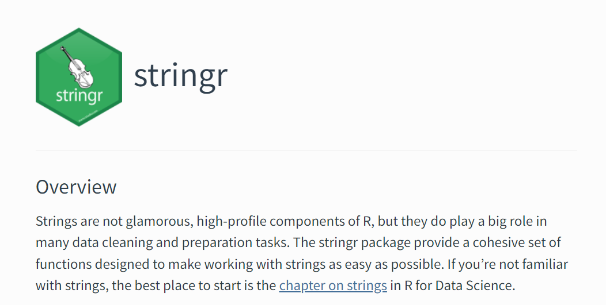
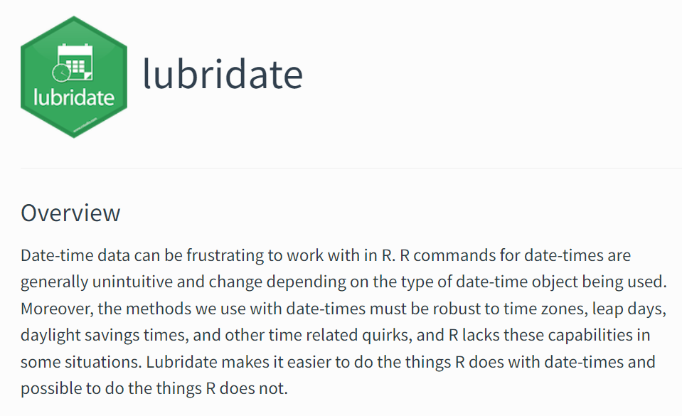

### {Stringr} - Processing Text with R




(***Source: stringr.tidyverse.org***)

---

### Useful Base R commands


#### Text

* <tt> grep()</tt>
* <tt> gsub()</tt>
* <tt> nchar()</tt>
* <tt> paste()</tt>
* <tt> readLines() </tt> and <tt>writeLines()</tt>
* <tt> matrix() </tt>

#### Dates

* <tt> Sys.Date()</tt>
* <tt> as.Date()</tt>

---

#### <tt>matrix()</tt>

```{r}
colours()[1:16]
```

```{r}
matrix(colours()[1:16],nrow=4,byrow=TRUE)
```

---

### {lubridate} - Working with dates with R




(***Source: lubdridate.tidyverse.org***)
