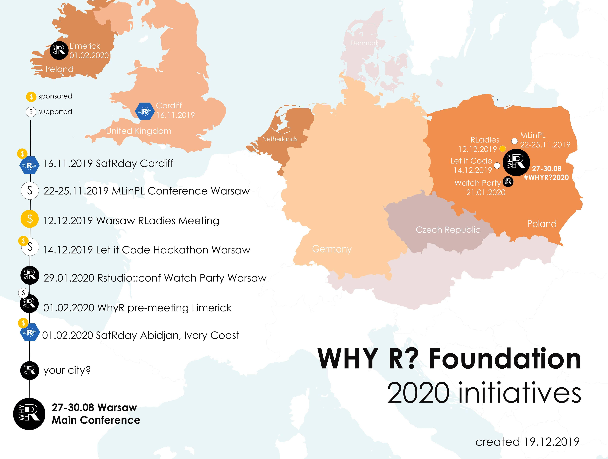
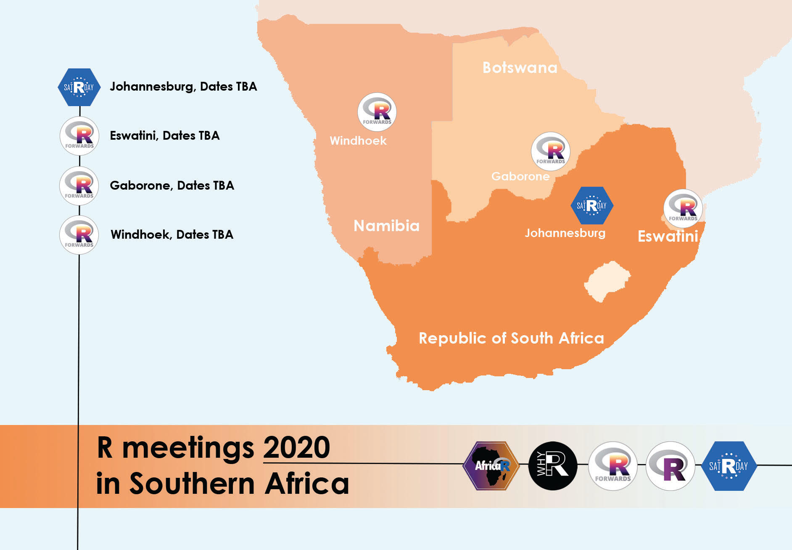

Why R? @ Career Zoo Limerick
======================================

* Saturday 1st February 2020
* Thomond Park Stadium, Cratloe Road, Limerick/
* 10.00am to 16:30pm approx
* Career Zoo Limerick's [Website](https://www.careerzoo.ie/limerick/)
* Why R? Limerick's [Website](https://www.careerzoo.ie/limerick/why-r-mini-conference.html)
* Admission is free, but attendees must have registered for Career Zoo.
* Personnel order: Kevin O'Brien, Joseph O'Brien, David Curran and Agnes Maciocha

#### Why R Pre-Meeting Series

* Why R? - [Website](https://www.whyr.pl)

 

## Schedule (Provisional)

#### 10:00 - 10:30 MORNING TALK 1 (Munster Suite)
* What makes a good (fantasy) football manager?
* Presented by [Joey O'Brien](https://twitter.com/obrienj_)

#### 10:30 - 11:00 MORNING TALK 2 (Munster Suite)

* Using R-Shiny to Teach Quantitative Research Methods
* Presented by [Dr. Brendan Halpin (UL Sociology)](https://twitter.com/BrendanTHalpin)

------------------------------------------------------

#### 11:10 CAREER ZOO COMMUNITY KEYNOTE @ Main stage

* [Dr. Norah Patten](https://twitter.com/SpaceNorah)
* Astronaut candidate with Project PoSSUM (Polar Suborbital Science in the Upper Mesosphere)
* N.B. This is not an R-specific talk
* TBC with Career Zoo Organizers

------------------------------------------------------

#### 11.50  MORNING TALK 3 (Munster Suite)
* ETL with R: a quantitative finance application
* Davide Magno

* *Parallel to Creating an Autonomous Driving Hub*
* *N.B. Julia Computing should be scheduled in to be available for this* 

------------------------------------------------------

#### 12.30 CAREER ZOO COMMUNITY KEYNOTE @ Main stage
* Helping beekeepers to reduce #honeybee losses & increase hive productivity with IOT technology.
* Dr Fiona Edwards Murphy, CEO and Co-founder of ApisProtect 
* N.B. This is not an R-specific talk
* TBC with Career Zoo Organizers

------------------------------------------------------
------------------------------------------------------

#### 13.10  LUNCH

* No Talk Scheduled
* (*Parallel to: Sci-tech / Life Balance. Meet the STEM workers who have chosen the Midwest* )

------------------------------------------------------
------------------------------------------------------

#### 13.40  AFTERNOON TALK 1 (Munster Suite)
* Citizen Science
* Presented by Liz Gabbett
* *Parallel to: "Keynote Panel with Jaguar Land Rover"*

#### 14.10  AFTERNOON TALK 2 (Munster Suite)

* Data Optimisation Network
* Gaurav Pahuja
* Finalist in the European DatSci Student Data Scientist of the Year Awards 2019
* (*Parallel to: Sci-tech Ecosystem in the Midwest*)

####  14.40  AFTERNOON TALK 3 (Munster Suite)
* Visualizing Trends in the Loudness of Popular Music
* Presented by [David Curran](https://twitter.com/iamreddave)

* *Parallel to: "Opportunities in Aviation"*

------------------------------------------------------
#### 15.10 CAREER ZOO COMMUNITY KEYNOTE @ Main stage

* [Abeba Birhane](https://twitter.com/Abebab) - Award winning PHD Student on ethics in AI 
* TBC with Career Zoo Organizers
* N.B. This is not an R-specific talk
* (This talk might be reschedule to previous slot)
------------------------------------------------------

#### 15.40 AFTERNOON TALK 4 (Munster Suite)
* Sorcha O'Callaghan
* Central Statistics Office, Cork

#### 16:20 AFTERNOON TALK 5 (Munster Suite)
* Agnes Maciocha (IT Carlow)
* Starting Time TBC
* Due to arrive at 16:00
* *Parallel to AI and emerging technologies creating new careers* 

